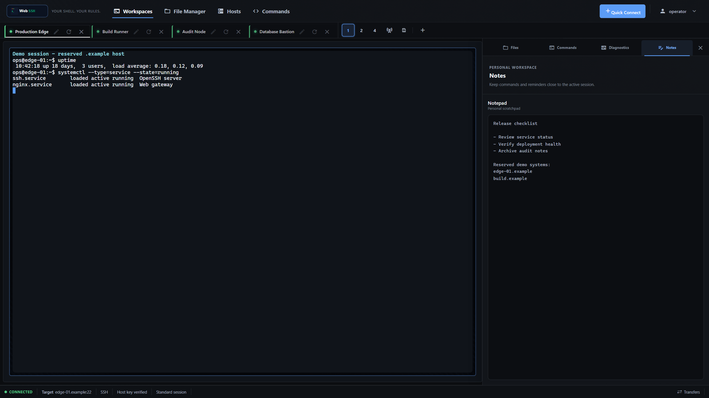
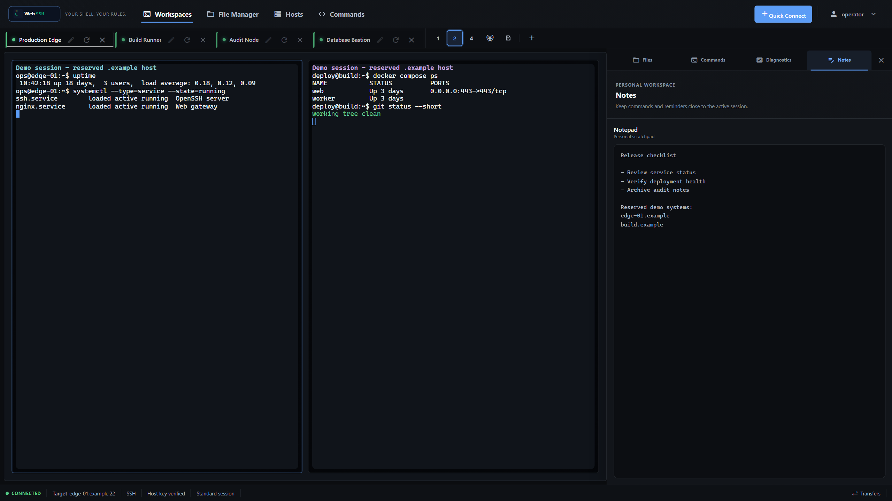
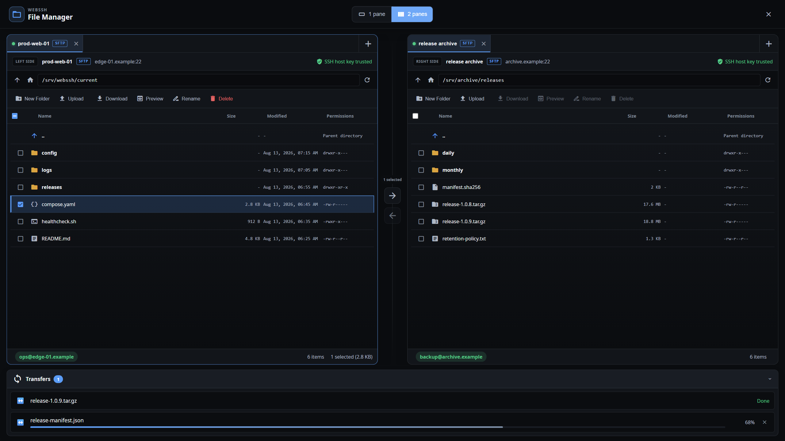
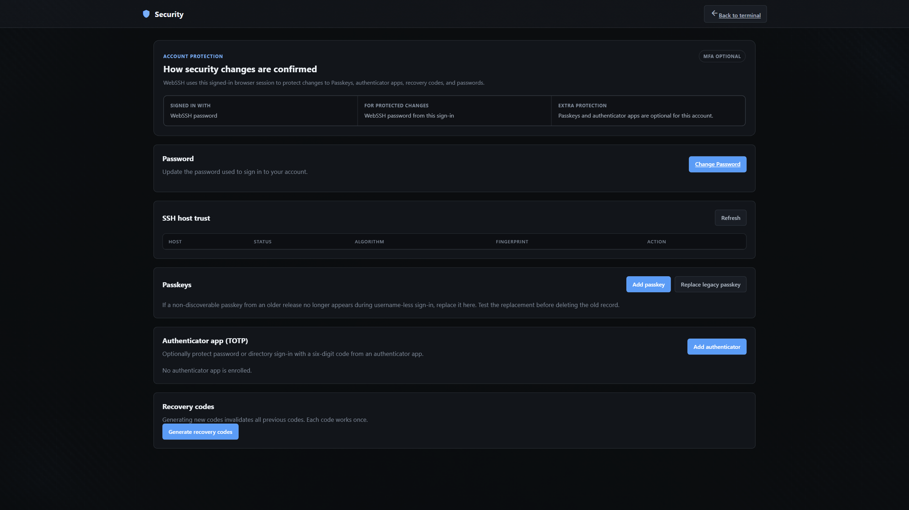
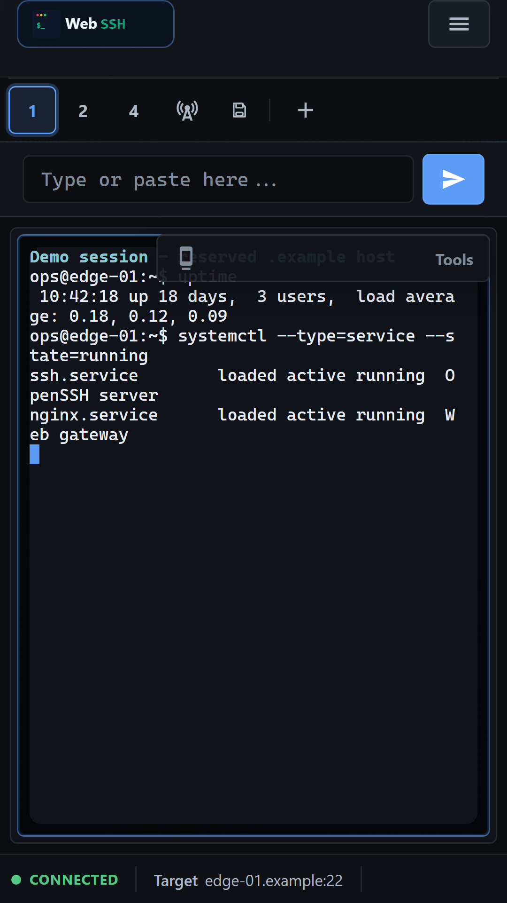
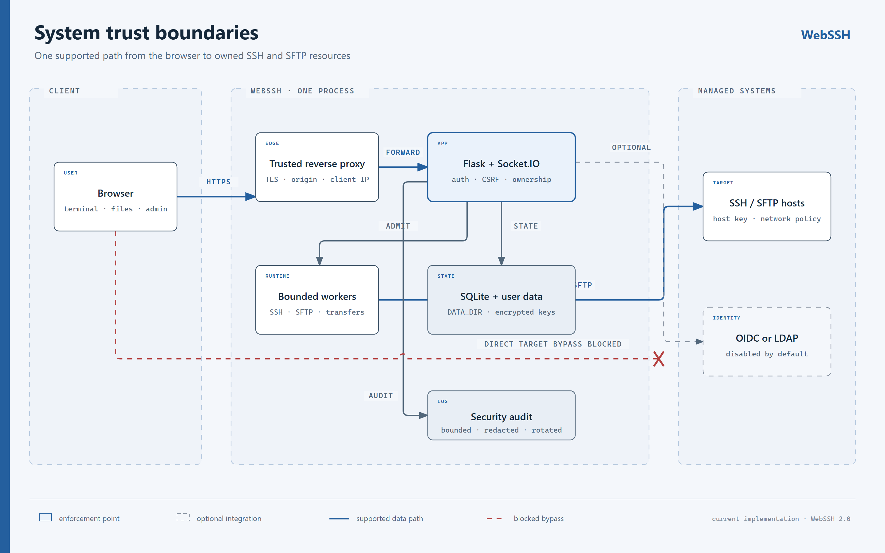

<p align="center">
  
</p>

<p align="center">
  <strong>A secure, self-hosted SSH and SFTP workspace for homelabs and teams.</strong>
</p>

<p align="center">
  <a href="https://bifrost0x.github.io/webssh/">Product site</a> ·
  <a href="https://github.com/bifrost0x/webssh/wiki">Documentation</a> ·
  <a href="https://github.com/bifrost0x/webssh/pkgs/container/webssh">Container image</a> ·
  <a href="https://github.com/bifrost0x/webssh/discussions">Discussions</a>
</p>

<p align="center">
  <a href="https://github.com/bifrost0x/webssh/actions/workflows/tests.yml"></a>
  <a href="https://github.com/bifrost0x/webssh/actions/workflows/github-code-scanning/codeql"></a>
  <a href="https://github.com/bifrost0x/webssh/pkgs/container/webssh"></a>
  
  <a href="LICENSE"></a>
  <a href="https://bifrost0x.github.io/webssh/code-graph/"></a>
</p>

## Product tour

<p align="center">
  
</p>

WebSSH keeps terminal work, files, commands, diagnostics, and notes in one
responsive browser workspace. It is self-hosted, multi-user, and built without
a hosted control plane or runtime CDN dependencies.

## Why WebSSH

- **One workspace, not a terminal tab.** Keep SSH sessions, SFTP sources,
  commands, live Linux context, and notes aligned with the active server.
- **Self-hosted by design.** Accounts, profiles, encrypted keys, host trust,
  audit records, and application data remain on your WebSSH instance.
- **Safe operational boundaries.** Authentication, ownership checks, network
  policy, host-key verification, quotas, and bounded runtime work are explicit.
- **Useful from phone to workstation.** The same interface adapts from a focused
  mobile shell to multi-pane desktop operations.

## Features

### Terminal workspace

- Multiple SSH sessions with tabs and 1-, 2-, or 4-pane layouts.
- Persistent remote shells through tmux when tmux is available on the target.
- Saved connections, jump hosts, key, password, and optional Tailscale SSH
  authentication paths.
- Broadcast input, terminal search, transcripts, reconnect controls, and
  configurable scrollback.
- Session-aware Files, Commands, Diagnostics, and Notes contexts.
- **Active Session Monitoring** for supported Linux resource and runtime data.
- **Expanded Diagnostics** for resource history, processes, systemd services,
  and Docker containers.
- **Clipboard-Only Service Actions** that prepare allowlisted commands without
  executing the service change inside WebSSH.

### Files and transfers

- Source-first SFTP workspace with independent tabs and one or two file panes.
- Uploads, downloads, previews, inline text editing, and common file operations.
- Streamed HTTP bulk transfers with Socket.IO limited to control events and
  bounded editor content.
- Server-to-server SFTP transfers with progress, cancellation, and a shared
  transfer queue.
- Per-user ownership checks, size limits, quotas, and path validation.
- SMB is visible only as **Coming soon**; no SMB backend is active.

### Identity and security

- Local multi-user accounts with isolated profiles, keys, files, settings, and
  SSH host trust.
- Optional Passkeys, authenticator apps (TOTP), and one-time Recovery Codes.
- Optional OIDC and LDAP/Active Directory sign-in with conservative account
  linking and assurance handling.
- Action-bound confirmation for protected account and administrative changes.
- Encrypted SSH private-key storage and per-user known-host decisions.
- CSRF protection, secure response headers, rate limits, request limits, audit
  logging, and production fail-closed checks.

### Operations and administration

- Docker and Docker Compose deployment with a persistent data volume.
- Health and readiness endpoints for deployment checks.
- User administration, registration controls, security feature gates, and
  structured audit export and retention.
- Native backup and restore with maintenance mode, staging isolation, quotas,
  explicit confirmation, and bounded execution.
- Optional Redis-backed rate-limit counters.
- Vendored browser dependencies, restrictive CSP, and no built-in telemetry.

## Screenshots

### Focused session workspace

<p align="center">
  
</p>

The active session stays central while contextual tools remain close at hand.

### Multiple live sessions

<p align="center">
  
</p>

Split panes make side-by-side observation and coordinated work visible without
mixing session ownership or terminal state.

### SFTP workspace

<p align="center">
  
</p>

Each pane has an explicit source, endpoint, path, trust state, and selection.

<p align="center">
  
</p>

### Security Center

<p align="center">
  
</p>

The Security Center explains how the current sign-in confirms protected
changes and keeps factors and SSH trust in one account-owned view.

### Mobile workspace

<p align="center">
  
</p>

## Quick Start

The supplied Compose file is intended for evaluation and trusted homelab
networks. It stores the database, generated application secret, user data, and
encrypted keys in the `webssh_data` volume.

```bash
mkdir webssh-deployment
cd webssh-deployment
curl -O https://raw.githubusercontent.com/bifrost0x/webssh/main/docker-compose.yml
docker compose up -d
```

Open <http://localhost:5000>. On a new instance, create the first administrator
immediately from a trusted network. The one-time browser bootstrap closes after
that account exists.

Verify the container and readiness endpoint:

```bash
docker compose ps
curl -fsS http://localhost:5000/ready
```

For an Internet-facing instance, do not expose this homelab configuration
unchanged. Use the production overlay, an HTTPS reverse proxy, exact origins,
secure cookies, disabled browser registration, internal-target blocking, and
explicit trusted-proxy settings.

Read the [Quick Start](docs/wiki/Quick-Start.md) or
the complete [Production Deployment](docs/wiki/Production-Deployment.md)
guide before accepting users.

## Security Boundary

<p align="center">
  
</p>

WebSSH is trusted infrastructure. It processes connection credentials,
terminal input and output, and file data while establishing and maintaining SSH
and SFTP sessions. It is not an end-to-end encrypted relay that is blind to
session contents.

Keep these deployment contracts intact:

- Terminate HTTPS at a trusted boundary and protect the WebSSH host, data
  volume, logs, backups, and administrator accounts.
- Review SSH host-key fingerprints before trusting them and investigate
  unexpected changes.
- Production uses exactly **one Gunicorn `gthread` worker**. Live SSH state and
  part of the resource coordination are process-local; multiple workers or
  replicas are not supported without an external session-state architecture.
- Thread count, socket admission, per-user socket limits, background workers,
  and quotas form one capacity model. Keep HTTP capacity reserved.
- External OIDC or LDAP identity never bypasses the local account, ownership,
  or authorization model. Retain a tested local break-glass administrator.
- Backups can contain the persisted application secret and encrypted private
  keys together. Protect and test them accordingly.

See the [Security Model and Hardening](docs/wiki/Security-Model-and-Hardening.md)
guide and the project's [security policy](SECURITY.md) before exposing WebSSH
to untrusted networks.

## Documentation

The README is the project entry point. Detailed installation, operation,
security, authentication, recovery, and development guidance lives in the
[WebSSH Wiki](docs/wiki/Home.md).

| Goal | Guide |
|---|---|
| Install with Docker | [Docker and Docker Compose](docs/wiki/Docker-and-Docker-Compose.md) |
| Deploy behind HTTPS | [Production Deployment](docs/wiki/Production-Deployment.md) |
| Configure every setting | [Configuration Reference](docs/wiki/Configuration-Reference.md) |
| Connect and verify hosts | [SSH Connections and Host Keys](docs/wiki/SSH-Connections-and-Host-Keys.md) |
| Use terminal and tmux sessions | [Terminal and Persistent tmux Sessions](docs/wiki/Terminal-and-Persistent-tmux-Sessions.md) |
| Work with files and transfers | [SFTP File Workspace and Transfers](docs/wiki/SFTP-File-Workspace-and-Transfers.md) |
| Configure authentication | [Authentication Overview](docs/wiki/Authentication-Overview.md) |
| Run backup or restore | [Backup, Restore and Secret Rotation](docs/wiki/Backup-Restore-and-Secret-Rotation.md) |
| Troubleshoot health checks | [Health Checks and Troubleshooting](docs/wiki/Health-Checks-and-Troubleshooting.md) |
| Understand the runtime | [Architecture and Runtime Lifecycle](docs/wiki/Architecture-and-Runtime-Lifecycle.md) |
| Develop and test locally | [Development and Testing](docs/wiki/Development-and-Testing.md) |

Additional project views:

- [Product site](https://bifrost0x.github.io/webssh/)
- [Interactive code graph](https://bifrost0x.github.io/webssh/code-graph/)
- [Container image](https://github.com/bifrost0x/webssh/pkgs/container/webssh)

## Contributing and Support

Bug reports and focused pull requests are welcome. For feature proposals and
architecture ideas, start with [GitHub Discussions](https://github.com/bifrost0x/webssh/discussions)
so the security and runtime boundaries can be reviewed before implementation.

- Read [Development and Testing](docs/wiki/Development-and-Testing.md).
- Use [Issues](https://github.com/bifrost0x/webssh/issues) for reproducible bugs.
- Report vulnerabilities privately through
  [GitHub Security Advisories](https://github.com/bifrost0x/webssh/security/advisories/new).
- Support ongoing work through [Buy Me a Coffee](https://buymeacoffee.com/bifrost0x).

## License

WebSSH is available under the [MIT License](LICENSE).
