<p align="center">
  
</p>

<p align="center">
  <strong>A secure, self-hosted SSH and SFTP workspace for homelabs and teams</strong>
</p>

<p align="center">
  <a href="https://bifrost0x.github.io/webssh/">Product Site</a> •
  <a href="#features">Features</a> •
  <a href="#quick-start">Quick Start</a> •
  <a href="#security">Security</a> •
  <a href="https://github.com/bifrost0x/webssh/pkgs/container/webssh">Container Image</a> •
  <a href="https://bifrost0x.github.io/webssh/code-graph/">Code Graph</a>
</p>

<p align="center">
  <!-- Statische Badges -->
  <a href="https://github.com/bifrost0x/webssh/pkgs/container/webssh"></a>
  
  
  
  <a href="https://buymeacoffee.com/bifrost0x">
    
  </a>
  <a href="https://bifrost0x.github.io/webssh/"></a>
  <a href="https://bifrost0x.github.io/webssh/code-graph/"></a>
  <br>
  <!-- GitHub Actions Workflows -->
  <a href="https://github.com/bifrost0x/webssh/actions/workflows/tests.yml">
    
  </a>
  <a href="https://github.com/bifrost0x/webssh/actions/workflows/github-code-scanning/codeql">
    
  </a>
  <a href="https://github.com/bifrost0x/webssh/actions/workflows/dependabot/dependabot-updates">
    
  </a>
  <a href="https://github.com/bifrost0x/webssh/actions/workflows/dependabot/update-graph">
    
  </a>
  <br>
  <a href="https://github.com/bifrost0x/webssh/actions/workflows/dependency-graph/auto-submission">
    
  </a>
  <a href="https://github.com/bifrost0x/webssh/actions/workflows/docker-publish.yml">
    
  </a>
</p>

---

## Overview

WebSSH is a secure, self-hosted workspace for SSH terminals and SFTP file operations in the browser. It is built for homelabs, server administration, and teams that want browser-based access without handing connection data to a hosted control plane. It is multi-user from the ground up, with separate accounts and per-user saved connections, keys, and settings. Browser dependencies are vendored locally, and WebSSH does not include telemetry.

<p align="center">
  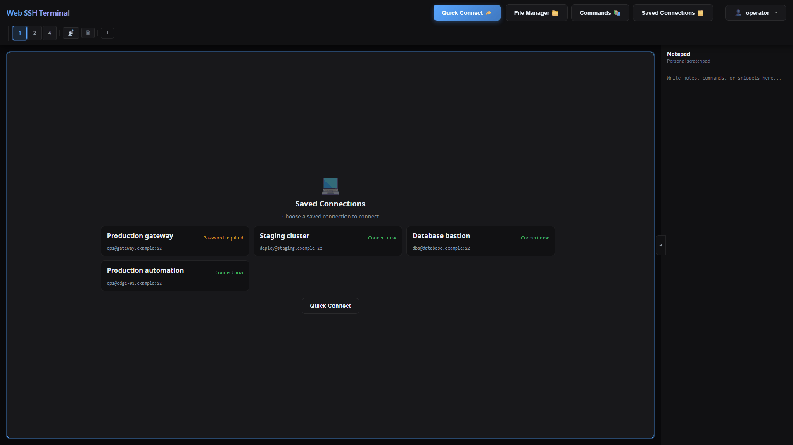
</p>

## Features

### Terminal

<p align="center">
  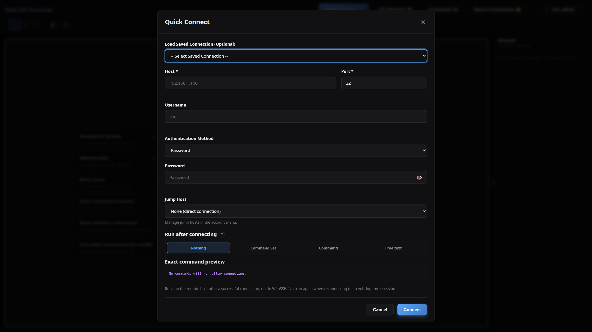
</p>

- **Broadcast Input** - Send a command to all open SSH sessions simultaneously (cluster-SSH style)
- **Multi-Session Support** - Up to 10 concurrent SSH sessions with tabs
- **Split Panes** - 1, 2, or 4-pane layouts for monitoring multiple servers
- **Session Restoration** - Restore live sessions after a page refresh without injecting terminal input
- **Persistent tmux Sessions** - Keep remote shells and running commands alive across browser closes and WebSSH restarts, then reattach later
- **Manual Reconnect** - Reconnect from a session tab; SSH-key and Tailscale sessions can reconnect directly, while password sessions reopen the pre-filled connection form
- **Saved Connection Launcher** - Empty terminal panes show saved connections; key and Tailscale connections start immediately when no password is needed, while password-dependent connections open pre-filled at the required field
- **Post-Connect Command Sets** - Build named, ordered command sequences and assign one to a connection or saved profile
- **Persistent Session Names** - Custom tab names are retained for persistent sessions across browsers
- **Configurable Scrollback** - Set 50 to 10,000 terminal lines and navigate them with the custom scrollbar
- **Copy/Paste** - `Ctrl+C` copies selected terminal text but still sends an interrupt when nothing is selected; `Ctrl+V` pastes (`Cmd+C` / `Cmd+V` on macOS)
- **Keyboard Shortcuts** - Ctrl+K command palette, Ctrl+F search, Ctrl+1–9 tab switching
- **Terminal Search** - Regex or plain-text in-terminal search (Ctrl+F)
- **Save Transcript** - Download the session output as a text file
- **Recent Connections** - Quick reconnect from your connection history
- **Session Notes** - Per-session notes, auto-saved as you type
- **Command Palette** - Fuzzy command launcher (Ctrl+K)

<p align="center">
  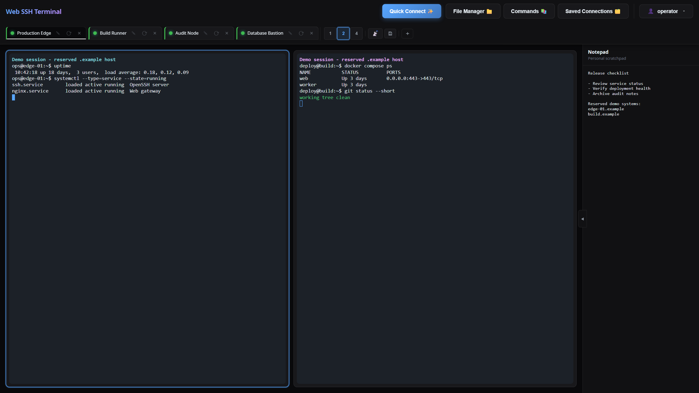
</p>

### File Manager (SFTP)
- **Dual-Pane Browser** - Side-by-side file browsing
- **Drag & Drop** - Transfer files between local and remote
- **Server-to-Server** - Direct transfer between SSH hosts
- **Batch Operations** - Multi-select for bulk actions
- **Context Menu** - Right-click for quick actions
- **File Preview** - Inline preview for images and code (syntax-highlighted), with log tail mode
- **Folder Download as ZIP** - Download entire directories as a ZIP archive
- **Quick Connect** - Browse files over SFTP without opening a terminal session
- **Local Filesystem Source** - Use your browser's local files as a transfer source
- **Transfer Queue** - Progress tracking with conflict resolution (skip / overwrite / apply to all)
- **Efficient Binary Transfer** - Raw binary streaming (~33% smaller than base64)
- **Inline Editor** - Edit text files directly in the browser and save back over SFTP

<p align="center">
  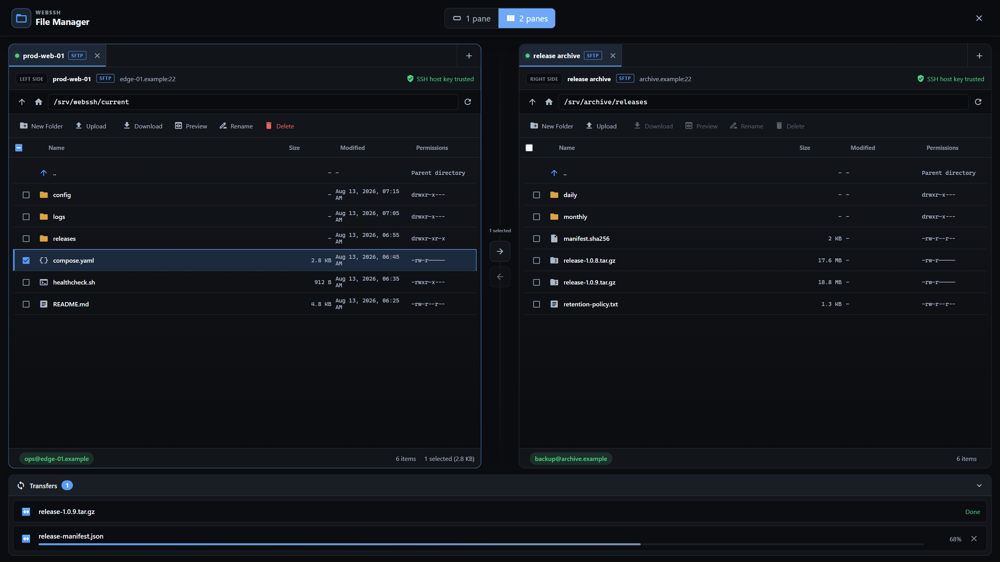
</p>

<p align="center">
  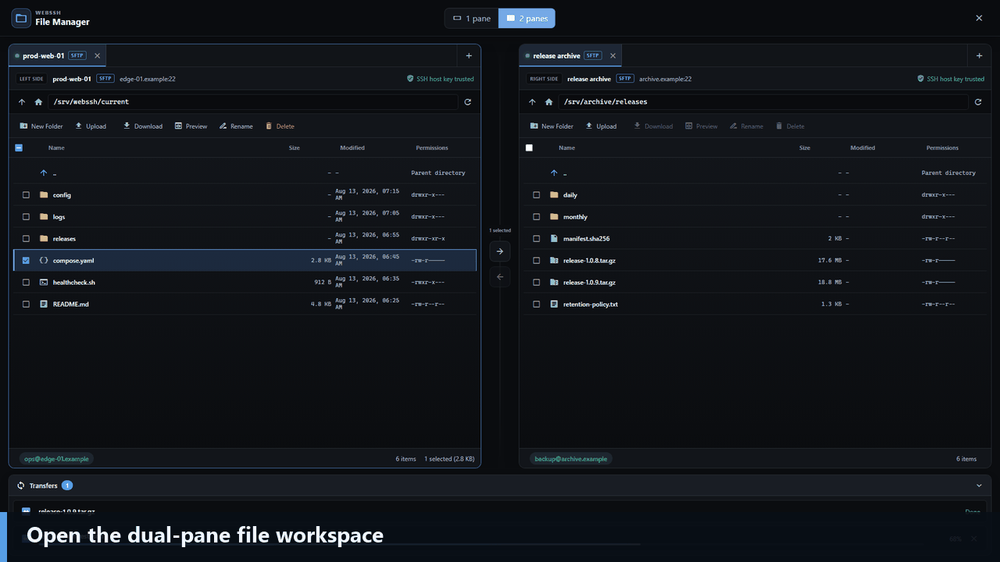
</p>

### Security
- **Encrypted Key Storage** - SSH keys encrypted at rest (Fernet / AES-128-CBC + HMAC)
- **Per-User Key Encryption** - Encryption key derived per user (`SECRET_KEY` + user id)
- **Secure Authentication** - bcrypt password hashing
- **CSRF Protection** - Token-based request validation
- **Rate Limiting** - Brute-force protection
- **Security Headers** - HSTS, CSP, X-Frame-Options
- **SSRF Protection** - Optionally block SSH to internal/loopback addresses (`BLOCK_INTERNAL_SSH`)
- **Host Key Auditing** - Persistent `known_hosts` policy with change detection
- **Host Trust Center** - Users can inspect and revoke their SSH trust records; administrators manage the global trust store
- **Passkeys** - Optional username-less WebAuthn sign-in with discoverable credentials and a safe legacy-passkey replacement flow
- **Recovery Codes** - One-time account recovery codes stored only as hashes
- **OpenID Connect** - Optional authorization-code flow with PKCE and explicit administrator linking by stable issuer and subject
- **Audit Logging & Export** - Structured JSON logs for auth, SSH, and file events, plus bounded administrator export and configurable retention
- **Session Ownership Checks** - Guards against cross-user session hijacking
- **Resource Quotas** - Global and per-user limits for SSH sessions, temporary connections, transfers, background jobs, and temporary disk use
- **Tailscale SSH** - Optional credential-free SSH through the WebSSH node's shared Tailscale identity, restricted by WebSSH users, targets, remote users, and tailnet policy

### Customization
- **10 Themes** - Dark, light, and colorful options
- **6 Languages** - English, Vietnamese, German, French, Spanish, Chinese
- **Saved Connections** - Save server configurations
- **Jump Hosts / ProxyJump** - Reach targets through a bastion; save jump hosts once, pick them per connection, with a clear "via &lt;bastion&gt;" indicator on the session
- **Command Library** - Store frequently used commands
- **OS-Aware Command Library** - Filter commands by detected OS (Linux / macOS / BSD / Windows)
- **Reusable Command Sets** - Combine library commands and free-text steps, reorder them, and reuse the result across profiles
- **SSH Key Management** - Import RSA, Ed25519, and ECDSA keys, encrypted at rest
- **Notepad** - Persistent scratchpad for notes, commands, and snippets
- **Mobile-Friendly** - Responsive layout for phones and tablets

<p align="center">
  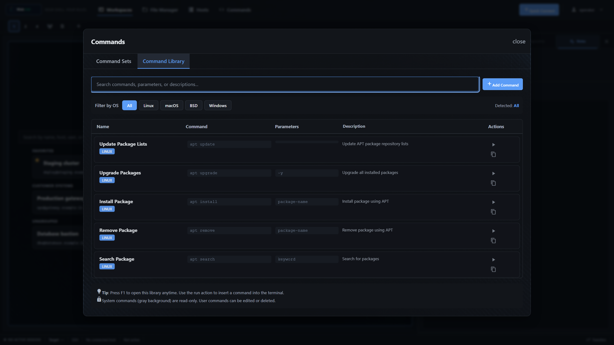
</p>
<p align="center">
  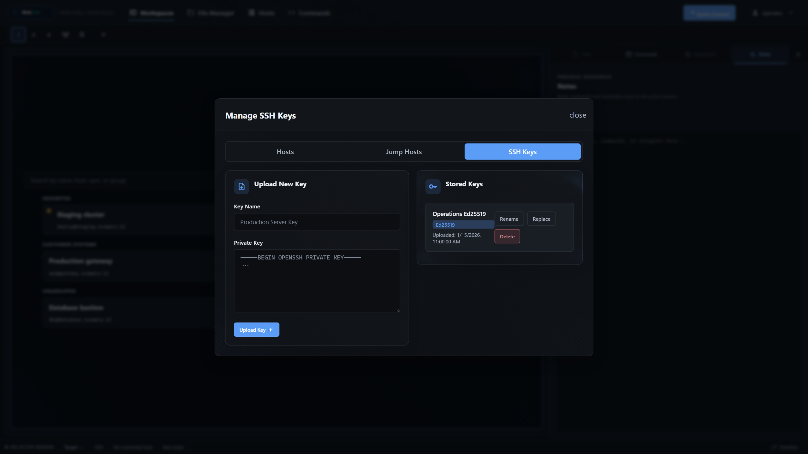
</p>
<p align="center">
  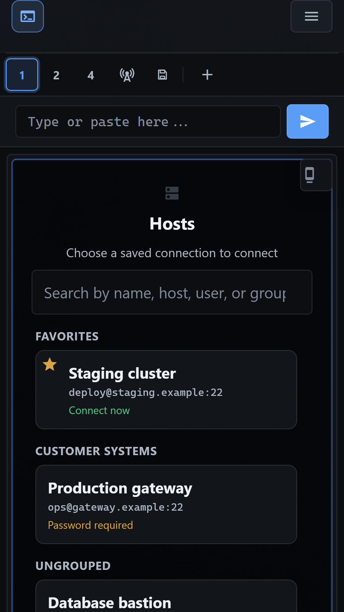
</p>

### Administration
- **Admin Panel** - Dedicated `/admin` page for administrators (role-gated)
- **User Management** - Create, lock/unlock, promote/demote and delete users; deletion revokes live access and quarantines the user's files outside the active user namespace
- **Audit Log Viewer** - Browse security events with level filter, search and pagination
- **Audit Retention & Export** - Adjust rotated-log retention and export bounded JSONL from the Admin Panel
- **Registration Toggle** - Enable or disable self-registration at runtime (hides the public sign-up link)
- **Safe Admin Bootstrap** - A fresh homelab opens one-time browser registration; exactly the first account becomes administrator and bootstrap registration then closes. `create-admin` remains available for production and recovery
- **Account Recovery Administration** - Generate replacement recovery sets and explicitly link or unlink stable OIDC identities after reauthentication
- **Offline Maintenance CLI** - Verified backup, restore, compatibility checks, and persisted-secret rotation with rollback safeguards

### Deployment
- **Docker & Docker Compose** - Single-command deployment with healthcheck
- **Reverse Proxy Ready** - Traefik, nginx, and Caddy examples included
- **Subfolder Deployment** - Host under a URL subpath like `/webssh` (see [Subfolder Deployment](#subfolder-deployment))
- **Homelab Friendly** - Wildcard CORS mode for internal networks

### Runtime lifecycle and graceful stops

WebSSH owns its cleanup loops, SSH output readers, and server-to-server
transfers through a bounded runtime lifecycle. Set `BACKGROUND_WORKERS` only
when the calculated default does not fit the deployment: it must be between
`3 + QUOTA_SSH_SESSION_GLOBAL + QUOTA_BACKGROUND_JOB_GLOBAL` and `128`.
The three permanent cleanup loops reserve the first three slots, so the default
with the shipped quotas is `3 + 10 + 4 = 17`; this leaves capacity for every
allowed SSH reader and background transfer.

`RUNTIME_SHUTDOWN_GRACE_SECONDS` defaults to `5` and accepts values from `1`
through `30`. On SIGTERM/SIGINT the process gate first signals lifecycle work
and waits at most that interval before continuing normal server termination.
The supplied Compose service uses a 40-second `stop_grace_period`, longer than
the maximum application grace. Gunicorn must continue to run exactly one worker
because live SSH state and quota accounting are process-local.

The native runtime uses Gunicorn 26 with the `gthread` worker class, exactly
one worker, and `GUNICORN_THREADS=64` by default (accepted range: 8 through
256). At most 48 Socket.IO connections are admitted globally and 8 per user
by default. Configuration must leave at least four Gunicorn threads free for
HTTP requests. Socket.IO runs with `SOCKETIO_ASYNC_MODE=threading` and
`SOCKETIO_ASYNC_HANDLERS=False`; there is no Eventlet worker, fallback, or
monkey patching path. One Gunicorn worker remains mandatory because live SSH
sessions and quota accounting are process-local.

The universal lock may contain `greenlet` only as SQLAlchemy's
platform-marked transitive dependency. It is not selected as the WebSSH worker
runtime and is unrelated to Eventlet or monkey patching. Removing it requires
a separately reviewed SQLAlchemy dependency change, not a runtime switch.

### Image-only runtime rollback

Keep the previously deployed immutable image, identified by its recorded
registry digest, available as a rollback artifact. To return from the
Gunicorn-26 image, stop the candidate and start that immutable image against
the same `/app/data` volume; do not restore, rewrite, or roll back the data
volume. Verify `/ready`, login, stored-key listing, a direct terminal, and SFTP
before returning service to users. Each successful publish stores the verified
repository, source revision, digest, and immutable reference in the GitHub
Actions artifact `image-release-<commit-sha>` for 90 days. Preserve the
currently deployed artifact before upgrading. The runtime migration changes no
persistent format.

## Quick Start

### Docker (Recommended)

```bash
# Run with Docker — SECRET_KEY is auto-generated and persisted to the volume
docker run -d \
  --name webssh \
  -p 5000:5000 \
  -e CORS_ORIGINS=http://localhost:5000 \
  -v webssh_data:/app/data \
  --restart unless-stopped \
  ghcr.io/bifrost0x/webssh:latest
```

> **Note:** Mounting a volume on `/app/data` keeps your users, keys, and the
> generated `SECRET_KEY` across updates. Set `SECRET_KEY` explicitly only when
> an external secret-management policy requires it. WebSSH must still run as a
> single application worker because live SSH state is process-local.

Open http://localhost:5000. A fresh standard container redirects to
`/register`; exactly that first account becomes administrator and the one-time
bootstrap registration closes immediately afterward. Additional accounts can
be created by the administrator or enabled temporarily from the Admin Panel.
Do not expose an unclaimed fresh instance to untrusted networks.

### Docker Compose (Homelab)

```bash
# Download docker-compose.yml
curl -O https://raw.githubusercontent.com/bifrost0x/webssh/main/docker-compose.yml

# Start the service — SECRET_KEY is auto-generated and persisted to the volume
docker compose up -d
```

Open http://localhost:5000 and create the first administrator in the browser.
The registration page closes automatically after that account exists.

The default Compose file is explicitly labeled `homelab`. It preserves
HTTP-friendly settings and logs security warnings instead of refusing startup.

### Docker Compose (Production)

The production overlay requires Docker Compose 2.24.4 or newer because it uses
the `!override` tag to replace the homelab port binding safely.

Download both Compose files, set the public HTTPS origin, and apply the
production override:

```bash
curl -O https://raw.githubusercontent.com/bifrost0x/webssh/main/docker-compose.yml
curl -O https://raw.githubusercontent.com/bifrost0x/webssh/main/docker-compose.production.yml

export WEBSSH_ORIGIN=https://ssh.example.com
docker compose \
  -f docker-compose.yml \
  -f docker-compose.production.yml \
  up -d

# Production keeps browser bootstrap closed; create or promote the admin here.
docker compose \
  -f docker-compose.yml \
  -f docker-compose.production.yml \
  exec webssh /app/entrypoint.sh flask --app start:app create-admin --username admin
```

The production profile refuses to start with debug mode, wildcard CORS,
insecure cookies, browser bootstrap, open registration, disabled
internal-address blocking, or an unspecified trusted-proxy boundary. The
override assumes one trusted reverse
proxy; set `TRUSTED_PROXIES=0` explicitly only when no proxy headers are
accepted. It binds WebSSH to `127.0.0.1:5000`, preventing direct clients from
spoofing trusted forwarded headers. Point a reverse proxy on the same host at
that address. For a containerized proxy, use a private shared network instead
and do not publish the WebSSH port publicly.

The command prompts for the password without echoing it. Running it for an
existing username promotes that account without changing its password. For
non-interactive provisioning, use `--password-file /path/in/container`; the
path must be a regular, non-symlink file. One trailing newline is removed, and
the password is never printed or written to the audit log.

### Tailscale SSH

Tailscale SSH is disabled by default because every authorized WebSSH account
uses the WebSSH node's **same Tailscale identity**. Enable it only for trusted
administrators or explicitly allowed homelab users. Use a dedicated Tailscale
tag, narrow ACL/SSH rules, and the optional WebSSH target and remote-username
allowlists. The backend enforces these controls; hiding the UI option is not the
security boundary.

Before enabling the feature, complete the one-time browser bootstrap in a
homelab or use `create-admin` in production. Keep normal self-registration
disabled unless it is explicitly needed.

See [Tailscale SSH deployment and security](docs/tailscale-ssh.md) for all
configuration variables, ACL guidance, audit behavior, and a Docker sidecar
example with persistent Tailscale state.

Only authorized WebSSH users see **Tailscale SSH** as an authentication method.
They can select it together with a saved profile and an optional post-connect
command set in the normal connection dialog.

<p align="center">
  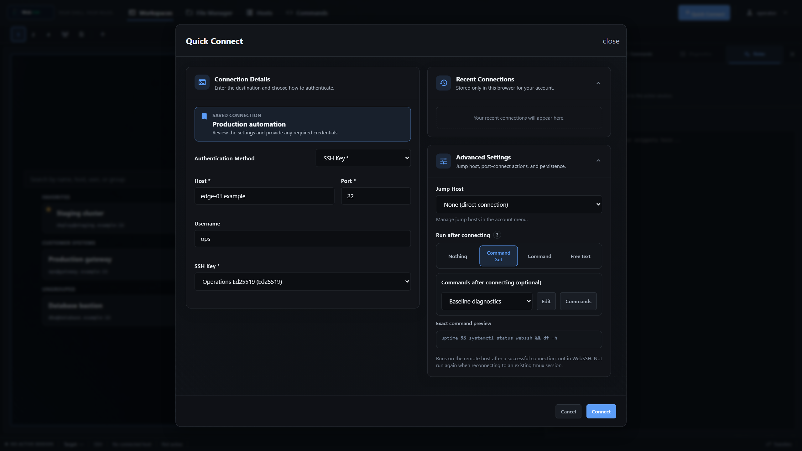
</p>

### Persistent tmux Sessions

The provided `docker-compose.yml` enables persistent tmux sessions and selects
them by default for new connections. tmux must be installed on the remote SSH
host, not inside the WebSSH container. WebSSH checks the target before starting
a persistent session; if tmux is unavailable, it logs a warning and falls back
to a regular shell without failing the SSH connection.

Closing the browser, an idle timeout, or restarting WebSSH leaves the remote
tmux session running so it can be reattached later. Explicitly disconnecting a
session from the WebSSH interface terminates its remote tmux session.

### Commands After Connecting

The connection dialog offers four explicit choices under **Run after
connecting**: nothing, one reusable **Command Set**, one saved **Command**, or
one-off **Free text**. Only the active mode is sent to the server. An exact
preview shows what will run before the connection is started. A selected
Command can use its saved parameters, an override, or an intentionally empty
override without modifying the library entry.

Open **Commands** to manage both reusable commands and sets. The **Command
Sets** tab is first and opens by default. The builder can search the complete
command library by name, command text, parameters, description, or category and
filter the results by operating system.

A command set is an ordered list of steps. A step can reference a command from
the command library or contain free text. Library steps use the command's
current parameters by default; disable **Use library parameters** to provide an
override or intentionally leave the override empty. Free-text steps can stay in
the set or be moved into the command library with **Save as library command**.
Steps can be reordered by drag and drop or by the accessible up/down buttons.

<p align="center">
  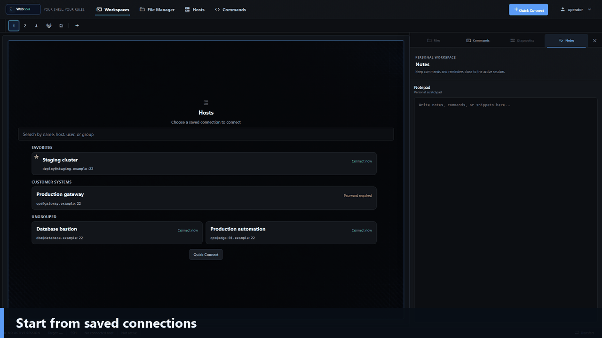
</p>

**Run commands with sudo** is opt-in for new command sets. When enabled, WebSSH
prefixes each non-empty resolved command line unless it already starts with
`sudo`; blank and comment-only lines remain unchanged. Existing command sets
from an earlier version and sets produced by legacy conversion keep their saved
sudo setting, so upgrading or converting does not change what runs.

WebSSH does not store or answer a sudo password. If the remote account requires
one, its normal prompt appears in the terminal. The added prefixes count toward
the existing maximum 4096 characters for the resolved command text.

Profiles are managed independently from connecting under the account menu.
They can be created, inspected, updated, or deleted without opening an SSH
session. A profile stores the selected post-connect mode and only its relevant
reference or free text; credentials are never stored. Editing a referenced set
or library command therefore updates every profile that uses its saved
definition. A set cannot be deleted while a profile references it, and a
user-created library command cannot be deleted while a set or profile
references it. The UI reports the profiles or sets that must be changed first.

After a new SSH connection succeeds, WebSSH resolves the latest referenced
commands on the server, validates the combined text (maximum 4096 characters),
and sends the steps to the remote interactive shell in their saved order.
Resolved command-set steps are joined with `&&` only between steps, so the next
block starts only when the preceding block succeeds. WebSSH does not rewrite a
step: line breaks inside a free-text step remain unchanged, including its
authored shell control flow, and the final command's exit status determines
whether the next step starts. The commands run on the remote SSH host, never
inside the WebSSH container. Reattaching to an existing persistent tmux session does not run them again.

Existing profiles that still contain the former free-text startup commands keep
working after an update. They show a legacy notice in the connection dialog and
can be converted into a named set. Conversion creates the set first, then links
the profile; the old text remains stored as a fallback but is ignored while the
new set reference is valid. The profile's legacy startup commands retain their
original multiline behavior until they are converted.

Command output and errors appear normally in the terminal. The remote shell
evaluates the `&&` chain; WebSSH does not interpret exit statuses itself. Treat
command sets like any other remote administration automation: review their
contents and grant WebSSH accounts only the SSH privileges they actually need.

No additional environment variable, Compose setting, frontend build step, or
external service is required. Command sets are stored per user in the existing
`DATA_DIR` volume alongside profiles and the command library.

## Installation

### From Source

```bash
# Clone the repository
git clone https://github.com/bifrost0x/webssh.git
cd webssh

# Create virtual environment
python -m venv venv
source venv/bin/activate  # Linux/macOS
# or: venv\Scripts\activate  # Windows

# Install dependencies
python -m pip install --require-hashes -r requirements.txt

# Set required environment variable
export SECRET_KEY=$(openssl rand -hex 32)

# Run the application
python start.py
```

### Building Docker Image

```bash
docker build -t webssh:local .
```

## Configuration

### Environment Variables

#### Core
| Variable | Required | Default | Description |
|----------|----------|---------|-------------|
| `SECRET_KEY` | Docker: no; source: yes | auto in Docker | Root key for signed browser sessions and per-user SSH-key encryption. Docker generates and persists it under `DATA_DIR`; non-Docker production must provide it explicitly: `openssl rand -hex 32` |
| `DEBUG` | No | `False` | Enable debug mode (development only) |
| `DEPLOYMENT_PROFILE` | No | `homelab` | `homelab` preserves compatibility and emits warnings; `production` rejects unsafe security combinations |
| `DATA_DIR` | No | `/app/data` | Persistent data directory |

#### Server
| Variable | Required | Default | Description |
|----------|----------|---------|-------------|
| `HOST` | No | `127.0.0.1` | Bind address (`0.0.0.0` in Docker) |
| `PORT` | No | `5000` | Listen port |
| `APPLICATION_ROOT` | No | - | URL subpath when deploying under a prefix (e.g. `/webssh`). See [Subfolder Deployment](#subfolder-deployment) |
| `TRUSTED_PROXIES` | Production: yes | `0` | Number of trusted proxy layers. Production requires an explicit value, including `0` when no proxy headers are trusted |

#### CORS & Security Headers
| Variable | Required | Default | Description |
|----------|----------|---------|-------------|
| `CORS_ORIGINS` | Production: yes | `localhost:5000` | Allowed origins for CORS (comma-separated). Production requires an explicit non-wildcard value |
| `ALLOW_CORS_WILDCARD` | No | `false` | Set `true` to allow `*` as CORS origin (homelab use only) |
| `SESSION_COOKIE_SECURE` | No | Auto | Set `true`/`false` to explicitly control secure cookies (auto-enabled in production) |

#### Features
| Variable | Required | Default | Description |
|----------|----------|---------|-------------|
| `REGISTRATION_ENABLED` | No | `False` in production, `True` in debug mode | Initial self-registration state. On a fresh database, the first registered account becomes administrator; later accounts do not. A saved Admin Panel setting takes precedence only in the homelab profile; production remains closed |
| `BOOTSTRAP_REGISTRATION_ENABLED` | No | `true` in homelab, `false` in production | Allow exactly one browser-created account while the database has no users. The path closes atomically after the first account; production rejects `true` |
| `WEBAUTHN_ENABLED` | No | `false` | Enable passkey enrollment and login for local accounts |
| `WEBAUTHN_RP_ID` | With WebAuthn | `localhost` | Exact relying-party domain, without scheme or port |
| `WEBAUTHN_RP_NAME` | No | `WebSSH` | Name shown by the authenticator |
| `WEBAUTHN_ORIGIN` | With WebAuthn | `https://localhost` | Exact public browser origin, including scheme and optional port |
| `MAX_WEBAUTHN_JSON_SIZE` | No | `65536` | JSON request limit for WebAuthn endpoints in bytes; values above the hard 65536-byte ceiling are capped |
| `HOST_KEY_MANAGEMENT_ENABLED` | No | `true` | Enable user and administrator host-key inventory and deletion routes |
| `RECOVERY_CODES_ENABLED` | No | `true` | Enable recovery-code generation and alternative login |
| `MAX_RECOVERY_JSON_SIZE` | No | `4096` | JSON request limit for recovery-code endpoints in bytes; values above the hard 4096-byte ceiling are capped |
| `AUDIT_EXPORT_ENABLED` | No | `true` | Enable administrator audit viewer, bounded export, and retention controls |
| `OIDC_ENABLED` | No | `false` | Enable the optional authorization-code flow with PKCE |
| `OIDC_ISSUER` | With OIDC | - | Exact OpenID Provider issuer URL |
| `OIDC_CLIENT_ID` | With OIDC | - | Registered client identifier |
| `OIDC_CLIENT_SECRET_FILE` | With OIDC | - | Path to a private file containing the client secret; the secret is not accepted inline |
| `OIDC_ALLOWED_SUBJECTS` | No | - | Optional comma-separated subject allowlist |
| `OIDC_ALLOWED_DOMAINS` | No | - | Optional comma-separated email-domain policy; identity linking still uses issuer and subject only |
| `OIDC_LOGIN_RATE_LIMIT` | No | `10 per minute` | Per-IP rate limit for starting OIDC login |
| `ADMIN_USERS` | No | - | Compatibility option: comma-separated existing usernames granted admin on startup. Prefer `create-admin` for explicit bootstrap |
| `ADMIN_PANEL_ENABLED` | No | `True` | Expose the role-gated Admin Panel and its API routes |
| `SESSION_TIMEOUT` | No | `1800` | Idle SSH session timeout in seconds (30 minutes) |
| `BLOCK_INTERNAL_SSH` | No | `false` | Block SSH connections to internal/loopback addresses (`true` or `false`) |
| `PROXY_JUMP_REMOTE_DNS_ALLOWLIST` | No | - | Exact comma-separated hostnames a trusted bastion may resolve remotely when local validation cannot resolve them; wildcards and IP literals are rejected |
| `TMUX_ENABLED` | No | `false` | Show and allow persistent tmux sessions. The provided Compose file sets this to `true` |
| `TMUX_DEFAULT` | No | `false` | Select persistent tmux for new connections by default. The provided Compose file sets this to `true` |
| `TMUX_SESSION_PREFIX` | No | `webssh` | Prefix used for tmux session names created on remote hosts |
| `TAILSCALE_SSH_ENABLED` | No | `false` | Enable shared-identity Tailscale SSH for administrators and explicitly allowed users |
| `TAILSCALE_SSH_ALLOWED_WEBSSH_USERS` | No | - | Comma-separated non-admin WebSSH usernames allowed to use Tailscale SSH |
| `TAILSCALE_SSH_ALLOWED_TARGETS` | No | - | Optional comma-separated exact host/IP allowlist for Tailscale SSH targets |
| `TAILSCALE_SSH_ALLOWED_REMOTE_USERS` | No | - | Optional comma-separated exact remote OS username allowlist for Tailscale SSH |
| `MAX_DOWNLOAD_SIZE` | No | `104857600` | Maximum file download size in bytes (100 MB) |
| `MAX_ZIP_DOWNLOAD_SIZE` | No | `524288000` | Maximum ZIP download size in bytes (500 MB) |
| `MAX_TRANSFER_MEMBERS` | No | `10000` | Maximum number of files, directories, and links traversed during one folder transfer |
| `MAX_PREVIEW_SIZE` | No | `512000` | Maximum bytes loaded into memory for one file preview |
| `MAX_PREVIEW_TAIL_LINES` | No | `10000` | Maximum requested line count for tail-mode previews |
| `MAX_SUPPORTED_FILE_SIZE` | No | `1073741824` | Maximum remote file size accepted by the preview service (1 GiB) |
| `SFTP_OPERATION_TIMEOUT` | No | `30` | Timeout in seconds for individual SFTP channel operations |
| `TRANSFER_TEMP_DIR` | No | `<DATA_DIR>/tmp` | Private local directory for bounded fallback ZIP creation |
| `MAX_EDITOR_FILE_SIZE` | No | `5242880` | Maximum file size editable in the inline editor in bytes (5 MB) |
| `AUDIT_LOG_MAX_BYTES` | No | `10485760` | Maximum size of each structured application or security audit log before rotation (10 MiB) |
| `AUDIT_LOG_BACKUP_COUNT` | No | `5` | Number of rotated backups retained for each structured log |
| `BACKUP_MAX_MEMBERS` | No | `10000` | Maximum number of ZIP members, including the manifest |
| `BACKUP_MAX_FILE_SIZE` | No | `1073741824` | Maximum decompressed size of one backup file (1 GiB) |
| `BACKUP_MAX_TOTAL_SIZE` | No | `10737418240` | Maximum total decompressed backup size (10 GiB) |
| `BACKUP_MAX_COMPRESSION_RATIO` | No | `200` | Maximum decompressed-to-compressed ratio for one backup member |
| `BACKUP_MAX_MANIFEST_SIZE` | No | `10485760` | Maximum decompressed manifest size (10 MiB) |

Passkeys, OIDC, host trust, recovery codes, and audit retention are managed
from the Security and Admin pages. Recovery codes are shown once and stored
only as hashes. OIDC never auto-links by email: an administrator must link the
provider's stable `(issuer, subject)` identity to an existing local account.
When OIDC runs in Docker, mount the client-secret file read-only and point
`OIDC_CLIENT_SECRET_FILE` at its path inside the container.

Passkey sign-in uses username-less discoverable credentials so the
authentication-options endpoint does not reveal whether an account exists.
Passkeys created by an older release as non-discoverable credentials cannot be
used by this flow; sign in with the local password or a recovery code and
use **Replace legacy passkey** on the Security page. After current-password
confirmation, that path deliberately permits the same authenticator to create
a discoverable replacement. Test it before deleting the old record.

JSONL audit exports begin with a `webssh_audit_export` metadata record. Its
`truncated`, `scanned`, and `scan_limit` fields state whether the export reached
the bounded scan limit; the Admin UI also warns when an export is truncated.

#### Health and Readiness

`GET /health` is a process-liveness endpoint and returns HTTP 200 with
`{"status":"ok"}` while the application can serve requests. `GET /ready`
checks both the SQLite database and a create-write-fsync-delete probe inside
`DATA_DIR`. It returns HTTP 200 when both checks pass and HTTP 503 with only
the failed component categories when either dependency is unavailable. Docker
and Docker Compose use `/ready` for their built-in healthcheck.

#### Resource Quotas

All quota values must be positive integers. For SSH sessions, quick
connections, and transfers, the per-user value must be lower than the global
value so one account cannot consume all available slots. These counters are
in-process and therefore preserve, rather than replace, the mandatory
single-worker deployment model.

All listed quotas are enforced. Slot reservations are released on completion,
cancellation, expiry, and connection teardown. Temporary-byte reservations
cover local fallback archives, and background-job reservations bound
server-to-server transfer work submitted to the runtime executor.

| Variable | Required | Default | Description |
|----------|----------|---------|-------------|
| `QUOTA_SSH_SESSION_GLOBAL` | No | `10` | Maximum concurrent terminal SSH sessions |
| `QUOTA_SSH_SESSION_PER_USER` | No | `5` | Maximum concurrent terminal SSH sessions per user |
| `QUOTA_QUICK_CONNECTION_GLOBAL` | No | `12` | Maximum concurrent temporary SSH/SFTP connections |
| `QUOTA_QUICK_CONNECTION_PER_USER` | No | `3` | Maximum concurrent temporary SSH/SFTP connections per user |
| `QUOTA_TRANSFER_GLOBAL` | No | `8` | Maximum concurrent transfer records |
| `QUOTA_TRANSFER_PER_USER` | No | `2` | Maximum concurrent transfer records per user |
| `QUOTA_TEMP_BYTES_GLOBAL` | No | `1073741824` | Global temporary-storage reservation limit in bytes (1 GiB) |
| `QUOTA_TEMP_BYTES_PER_USER` | No | `536870912` | Per-user temporary-storage reservation limit in bytes (512 MiB) |
| `QUOTA_BACKGROUND_JOB_GLOBAL` | No | `4` | Maximum concurrent background transfer jobs |
| `QUOTA_BACKGROUND_JOB_PER_USER` | No | `1` | Maximum concurrent background transfer jobs per user |

#### Runtime lifecycle

| Variable | Required | Default | Description |
|----------|----------|---------|-------------|
| `BACKGROUND_WORKERS` | No | `3 + QUOTA_SSH_SESSION_GLOBAL + QUOTA_BACKGROUND_JOB_GLOBAL` (`17` with defaults) | Bounded executor capacity. Must be at least the displayed formula so three permanent cleanup jobs cannot starve allowed SSH readers or background transfers, and no more than `128` |
| `RUNTIME_SHUTDOWN_GRACE_SECONDS` | No | `5` | Bounded cancellation grace for SIGTERM/SIGINT. Must be from `1` through `30`; the supplied Compose service allows 40 seconds before forced stop |
| `GUNICORN_THREADS` | No | `64` | Threads in the mandatory single gthread worker; accepted range is 8 through 256 |
| `MAX_SOCKET_CONNECTIONS` | No | `48` | Process-wide admitted Socket.IO connections; must leave at least four Gunicorn threads for HTTP |
| `MAX_SOCKET_CONNECTIONS_PER_USER` | No | `8` | Admitted Socket.IO connections per user; cannot exceed the global limit |

For compatibility, the deprecated
`TemporaryConnectionPool(max_connections_per_user=...)` constructor argument
is still accepted but ignored. Configure the central
`QUOTA_QUICK_CONNECTION_PER_USER` limit instead.

#### Rate Limiting
| Variable | Required | Default | Description |
|----------|----------|---------|-------------|
| `RATELIMIT_ENABLED` | No | `True` | Enable rate limiting (`true` or `false`) |
| `RATELIMIT_LOGIN_LIMIT` | No | `5 per minute` | Login rate limit (format: `N per {second\|minute\|hour}`) |
| `RATELIMIT_REAUTH` | No | `5 per minute` | Per-user and per-IP limit for password-confirmed security operations |
| `SSH_CONNECT_RATELIMIT` | No | `10 per minute` | Per-user limit on SSH connection attempts (`ssh_connect` / `quick_connect`; format: `N per {second\|minute\|hour}`) |
| `RATELIMIT_DEFAULT` | No | `200 per hour` | Default rate limit for endpoints (format: `N per {second\|minute\|hour}`) |
| `RATELIMIT_STORAGE_URL` | No | `memory://` | Rate-limit storage (`memory://`, `redis://`, or `rediss://`). Redis preserves counters across app restarts while the Redis service remains available; it does not remove the single-worker requirement. |

### Configuration via .env file

Instead of exporting every variable, you can place them in a `.env` file in the
project root. It is loaded automatically on startup. Copy the provided template
to get started:

```bash
cp .env.example .env
# edit .env and set at least SECRET_KEY
python start.py
```

Real environment variables (set via the shell, Docker, or systemd) always take
precedence over values in `.env`, so the file works safely alongside existing
deployments. `.env` is git-ignored — never commit your real secrets.

### Reverse Proxy Setup

#### Traefik

```yaml
labels:
  - "traefik.enable=true"
  - "traefik.http.routers.webssh.rule=Host(`ssh.example.com`)"
  - "traefik.http.routers.webssh.tls.certresolver=letsencrypt"
  - "traefik.http.services.webssh.loadbalancer.server.port=5000"
```

#### Nginx

```nginx
location / {
    proxy_pass http://webssh:5000;
    proxy_http_version 1.1;
    proxy_set_header Upgrade $http_upgrade;
    proxy_set_header Connection "upgrade";
    proxy_set_header Host $host;
    proxy_set_header X-Real-IP $remote_addr;
    proxy_set_header X-Forwarded-For $proxy_add_x_forwarded_for;
    proxy_set_header X-Forwarded-Proto $scheme;
}
```

#### Caddy

```caddyfile
ssh.example.com {
    reverse_proxy webssh:5000
}
```

### Subfolder Deployment

To serve the app under a URL subpath like `https://server.local/webssh`, set:

```bash
APPLICATION_ROOT=/webssh
TRUSTED_PROXIES=1
```

Then configure your reverse proxy to strip the prefix and forward it via `X-Forwarded-Prefix`.

#### Nginx (subfolder)

```nginx
location /webssh/ {
    proxy_pass http://webssh:5000/;
    proxy_http_version 1.1;
    proxy_set_header Upgrade $http_upgrade;
    proxy_set_header Connection "upgrade";
    proxy_set_header Host $host;
    proxy_set_header X-Real-IP $remote_addr;
    proxy_set_header X-Forwarded-For $proxy_add_x_forwarded_for;
    proxy_set_header X-Forwarded-Proto $scheme;
    proxy_set_header X-Forwarded-Prefix /webssh;
}
```

#### Traefik (subfolder)

```yaml
labels:
  - "traefik.enable=true"
  - "traefik.http.routers.webssh.rule=Host(`server.local`) && PathPrefix(`/webssh`)"
  - "traefik.http.middlewares.webssh-strip.stripprefix.prefixes=/webssh"
  - "traefik.http.middlewares.webssh-prefix.headers.customrequestheaders.X-Forwarded-Prefix=/webssh"
  - "traefik.http.routers.webssh.middlewares=webssh-strip,webssh-prefix"
  - "traefik.http.services.webssh.loadbalancer.server.port=5000"
```

#### Caddy (subfolder)

```caddyfile
server.local {
    handle_path /webssh/* {
        reverse_proxy webssh:5000 {
            header_up X-Forwarded-Prefix /webssh
        }
    }
}
```

### Homelab Configuration

For homelab use where you access the service from various internal IPs:

```bash
DEPLOYMENT_PROFILE=homelab
CORS_ORIGINS=*
ALLOW_CORS_WILDCARD=true
TRUSTED_PROXIES=1
SESSION_COOKIE_SECURE=false
BLOCK_INTERNAL_SSH=false
```

> **Note:** Only use wildcard CORS in trusted network environments.

### Production Security Profile

For an Internet-facing deployment:

```bash
DEPLOYMENT_PROFILE=production
DEBUG=False
CORS_ORIGINS=https://ssh.example.com
ALLOW_CORS_WILDCARD=false
SESSION_COOKIE_SECURE=true
REGISTRATION_ENABLED=False
BOOTSTRAP_REGISTRATION_ENABLED=false
BLOCK_INTERNAL_SSH=true
TRUSTED_PROXIES=1
```

`SESSION_COOKIE_SECURE=true` remains required when the reverse proxy terminates
TLS and forwards plain HTTP to WebSSH: the flag describes the browser-facing
HTTPS connection. A production-profile administrator cannot reopen public
registration through the Admin Panel. When `TRUSTED_PROXIES` is non-zero, keep
the backend port restricted to the trusted proxy; the supplied production
Compose override binds it to loopback.

## Themes

Web SSH Terminal includes 10 themes:

| Theme | Style | Theme | Style |
|-------|-------|-------|-------|
| Glass Ops | Dark Blue | Paper Ops | Light |
| Retro Future | Amber | Noir Terminal | Purple |
| Solar Drift | Blue/Gold | Arctic Ice | Cyan |
| Rose Gold | Rose | Cyberpunk Neon | Magenta |
| Emerald Matrix | Matrix Green | Obsidian | Pure Black |

<p align="center">
  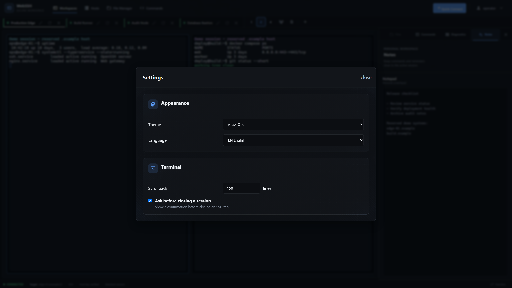
</p>

## Security

### Best Practices

1. **Always use HTTPS** in production (terminate TLS at reverse proxy)
2. **Generate unique SECRET_KEY** for each deployment
3. **Set specific CORS_ORIGINS** instead of wildcard
4. **Enable TRUSTED_PROXIES** only when behind a proxy
5. **Use strong passwords** (minimum 8 characters enforced)

### Security Features

- **Password Hashing**: bcrypt with automatic salt
- **Constant-time Login**: failed logins run a dummy hash so response timing does not reveal whether an account exists (user-enumeration resistant)
- **Key Encryption**: Fernet (AES-128-CBC + HMAC) for SSH keys at rest
- **Rate Limiting**: 5 login attempts per minute per IP, plus a per-user cap on SSH connection attempts (`ssh_connect` / `quick_connect`) to prevent abuse as a brute-force/scan proxy
- **CSRF Tokens**: All forms protected
- **Secure Cookies**: HttpOnly, SameSite=Lax, Secure (in production)
- **Security Headers**: HSTS, CSP, X-Content-Type-Options, X-Frame-Options
- **SSRF Protection**: with `BLOCK_INTERNAL_SSH=true`, hostnames are resolved and connections to loopback, link-local (incl. cloud-metadata `169.254.169.254`), private, and reserved addresses are blocked — a hostname that resolves to an internal address cannot bypass the guard
- **Request and Upload Limits**: unsafe control requests are bounded before CSRF parsing; Recovery and WebAuthn keep their documented limits, while SFTP uploads retain bounded streaming without whole-file buffering
- **Folder Download Limits**: `MAX_ZIP_DOWNLOAD_SIZE` bounds declared input and streamed ZIP bytes, while `MAX_TRANSFER_MEMBERS` bounds recursive entry counts, including zero-byte files; remote ZIPs stream directly over bounded HTTP, while the SFTP fallback uses a private, quota-reserved temporary file under `TRANSFER_TEMP_DIR`

### Paramiko 5 SSH Compatibility

Web SSH Terminal uses Paramiko 5 and supports imported RSA, Ed25519, and
ECDSA private keys. Modern RSA keys remain supported when the server negotiates
RSA/SHA-2 signatures. Passphrase-encrypted imported private keys are not
currently supported.

Paramiko 5 no longer supports DSA/DSS, RSA signatures using SHA-1
(`ssh-rsa` as a signature algorithm), SHA-1 key exchange, GSSAPI, or
group-exchange parameters below 2048 bits. Required SSH servers must offer
modern algorithms; Web SSH Terminal does not re-enable the removed algorithms.
Existing DSA/DSS key files are not deleted or rewritten automatically and must
be replaced before upgrading.

Before deploying the upgrade, run the read-only compatibility check against a
copy of `DATA_DIR`, using the same `SECRET_KEY` that encrypted the stored
keys:

```bash
SECRET_KEY='the-current-deployment-secret' \
python scripts/check_paramiko5_readiness.py \
  --data-dir /absolute/path/to/copied-data
```

Exit code `0` means every discovered key is compatible. Exit code `2`
means rollout is blocked by an unsupported, encrypted, unreadable, or unsafe
key entry. Never point the check at the active writable data volume; it is
designed for a read-only snapshot and never migrates plaintext legacy keys.
Its report omits key content, configured key names, filenames, paths, and the
`SECRET_KEY`.

### Web Backup and Restore

Administrators can create, download, verify, and restore backups from
**Administration > Backup & Restore**. This native feature is always present;
there are no feature flags that can silently disable backup or restore.

Web backup uses SQLite's native backup API and briefly coordinates persistent
file writers while it captures the database and file-based stores. WebSSH stays
online during creation. The temporary snapshot is deleted immediately after the
verified ZIP has been created. The verified archive is kept in a private
directory outside `DATA_DIR` only until its one-time, session-bound download or
until its TTL expires.

The archive includes the SQLite database, application settings, user profiles,
`known_hosts`, persisted application secret, SSH key metadata, encrypted private
keys, and the other persistent files covered by the CLI format. Runtime `logs/`,
`tmp/`, transient uploads, and incomplete transfer data remain excluded. New
web and CLI archives use format version 2 and are mutually compatible. Format
v2 records the WebSSH data-schema version, creation time, and producer in the
manifest. Existing format-v1 CLI archives remain supported as legacy schema 0
backups.

Archive verification and restore compatibility are separate decisions. A safe,
well-formed archive can be inspected even when it cannot be restored by the
running version. The Admin validation result shows the archive format, backup
and current data-schema versions, creation time, legacy status, and a
compatibility reason. Backups with the current schema are accepted. Older
schemas are accepted only when WebSSH has a complete registered migration path.
Backups with a newer schema are blocked server-side before restore preparation
and checked again before the destructive operation starts. Restoring a newer
backup into an older WebSSH release is not supported.

To restore, upload an archive in the same Admin tab. WebSSH verifies its
manifest, checksums, sizes, members, compression limits, and format before it
shows a non-sensitive summary. Restore then requires two explicit confirmations,
the exact phrase `RESTORE`, and the current administrator password. The service
enters maintenance mode, rejects new writes and SSH sessions, closes active
runtime activity, creates an online-consistent emergency rollback archive, and
replaces the persistent state. All browser sessions are invalidated.

After a successful restore, the process terminates intentionally. Docker
Compose and Portainer deployments using `restart: unless-stopped` restart the
container automatically. The Admin page reports the operation while possible;
a disconnect during the final step means the administrator should wait for
`/ready` and sign in again. An interrupted restore is detected on startup and
rolled back from the emergency archive. If both restore and rollback fail,
maintenance mode remains active and the operator must use the CLI restore path.
A successful confirmed CLI restore clears this recovery-only maintenance state;
the following application start removes the retained temporary rollback files.

Backup archives are highly sensitive. HTTPS protects transport only; it does
not encrypt the downloaded ZIP at rest. Store downloads encrypted, off-host,
with administrator-only access, and dispose of them according to a retention
policy.

Web restore is intentionally treated as a high-risk administrative operation,
not as a routine user action. Keep the Admin interface behind HTTPS and trusted
access controls, retain an encrypted off-host backup, and keep the offline CLI
restore procedure available when the web process or its current data schema
cannot start safely.

Operational configuration:

| Variable | Default | Purpose |
|----------|---------|---------|
| `BACKUP_UPLOAD_MAX_SIZE` | `1073741824` | Maximum streamed web upload size in bytes |
| `BACKUP_OPERATION_TIMEOUT` | `1800` | Operation and retained-status timeout in seconds |
| `BACKUP_DOWNLOAD_TTL` | `600` | TTL for generated downloads and verified uploads in seconds |
| `BACKUP_TEMP_DIR` | system temp + `webssh-backup-operations` | Private temporary base outside `DATA_DIR`; WebSSH creates an isolated namespace per resolved data directory |
| `RATELIMIT_BACKUP_CREATE` | `3 per hour` | Per-admin/IP creation rate |
| `RATELIMIT_BACKUP_UPLOAD` | `5 per hour` | Per-admin/IP upload rate |
| `RATELIMIT_BACKUP_DOWNLOAD` | `10 per hour` | Per-admin/IP download rate |
| `RATELIMIT_BACKUP_RESTORE` | `3 per hour` | Per-admin/IP restore-attempt rate |

### CLI Backup, Restore, and Secret Rotation

Run mutating maintenance commands only while every WebSSH application process
that uses the data directory is stopped. Archives contain the database, user
stores, host keys, encrypted SSH keys, and—when the default Docker secret
storage is used—the persisted `SECRET_KEY`. Store archives encrypted and with
access restricted to administrators. Runtime `logs/` and incomplete transfers
under `tmp/` are intentionally excluded.

```bash
# Stop WebSSH first, then create and verify a private archive outside DATA_DIR.
flask --app start:app backup create \
  --destination /secure-backups/webssh.zip \
  --confirm-offline

flask --app start:app backup verify /secure-backups/webssh.zip

# Restore verifies every manifest checksum before writing any file.
flask --app start:app backup restore \
  /secure-backups/webssh.zip \
  --confirm-offline

# Creates a verified pre-rotation backup, re-encrypts and verifies every stored
# SSH key, publishes the persisted secret last, and rolls back on failure.
flask --app start:app rotate-secret-key --confirm-offline
```

For Docker Compose, mount a private host backup directory into the one-off
maintenance container:

```bash
mkdir -p backups
chmod 700 backups
docker compose stop webssh
docker compose run --rm \
  -v "$PWD/backups:/backup" \
  webssh flask --app start:app backup create \
  --destination /backup/webssh.zip \
  --confirm-offline
docker compose run --rm \
  -v "$PWD/backups:/backup:ro" \
  webssh flask --app start:app backup verify /backup/webssh.zip
docker compose up -d
```

Keep the service stopped for restore or rotation as well. After a successful
rotation, restart it immediately so the application loads the new secret.
`rotate-secret-key` deliberately supports only the secret persisted at
`DATA_DIR/secret_key`; it refuses missing or mismatched state. If `SECRET_KEY`
comes exclusively from Docker Secrets, Kubernetes, systemd credentials, or
another external secrets manager, rotate that external value with a separate
controlled migration procedure instead of this command.

### Hosting & Data Protection

Web SSH Terminal is the SSH/SFTP client: the browser connects to this server,
and this server opens the connection to the target host. For team use or a
hosted deployment, treat the Web SSH Terminal host as trusted infrastructure.

#### Data processed by the server

While a connection is being established or is active, the server handles:

- **SSH credentials during connection setup.** Target and jump-host passwords,
  or the decrypted private key selected for authentication, are passed to
  Paramiko. Passwords are not written to profiles, the database, or audit logs,
  and credentials are not kept in the in-memory SSH session object. Local
  references are dropped after the connection attempt; Python does not provide
  a guarantee that secret bytes are securely zeroed from process memory.
- **Terminal data.** Keystrokes, remote output, broadcast input, and transcript
  data are relayed through the server.
- **SFTP data.** Uploads, downloads, previews, editor saves, and ZIP folder
  downloads pass through the server process.

The persistent data directory contains:

- The SQLite database with usernames, bcrypt password hashes, account flags,
  timestamps, browser-session metadata, and SSH-session metadata. SSH transport
  connections themselves remain in memory; the database record does not make a
  connection survive a server restart.
- Per-user JSON files for profiles, jump hosts, commands, notepad content, and
  settings. Saved profiles and jump-host definitions do not contain passwords.
- Encrypted SSH private keys and their metadata.
- Quarantined files from deleted accounts under
  `DATA_DIR/deleted_users/user_<id>_<uuid>`. Deleting an account revokes its
  live access and moves its active `users/user_<id>` directory atomically out
  of the active namespace; it does not securely erase the retained files.
- Persistent `known_hosts` fingerprints.
- Application and audit logs. Depending on the event, audit entries include
  usernames, source IPs, user agents, target hosts, filenames, sizes, and
  timestamps.

An administrator with access to the host or Python process can observe live
session content. Access to the data volume exposes account metadata, saved
configuration, logs, and — with the default Docker setup — the persisted
`SECRET_KEY`. Restrict access to the host, data volume, logs, and backups.

#### Security boundary

- SSH connection passwords are not intentionally persisted. Web SSH Terminal
  login passwords are stored only as bcrypt hashes.
- The project contains no built-in telemetry and serves its frontend libraries
  from `static/vendor/` instead of runtime CDNs. Connections explicitly
  requested by users, such as SSH targets and DNS lookups, still leave the host.
- This is **not end-to-end encryption between the browser and target host**.
  TLS protects browser-to-server traffic when configured at the reverse proxy,
  and SSH protects server-to-target traffic, but the Web SSH Terminal process
  necessarily handles terminal and file data in plaintext between those links.

#### SSH key protection

- Private keys are encrypted at rest with Fernet (AES-128-CBC with
  HMAC-SHA256 authentication).
- A per-user Fernet key is derived with PBKDF2-HMAC-SHA256 (600,000 iterations)
  from `SECRET_KEY` and the user id. One user's derived key therefore does not
  decrypt another user's key files.
- The keys directory is set to `0700`, and key files are written with `0600`
  permissions.
- Keys are decrypted when needed for authentication. Legacy plaintext key files
  are migrated to the encrypted format when first read.
- `SECRET_KEY` is the root of trust. Docker generates it on first start and
  stores it in `DATA_DIR/secret_key` unless supplied through the environment.
  Anyone with both the encrypted key files and this secret can decrypt the
  keys. For stronger separation, provide `SECRET_KEY` through an external
  secrets mechanism and protect backups of `DATA_DIR` accordingly.

#### Session protection

Browser sessions use Flask-Login cookies signed with `SECRET_KEY`. Session and
remember-me cookies are `HttpOnly`, `SameSite=Lax`, and secure by default outside
debug mode unless explicitly overridden with `SESSION_COOKIE_SECURE`. Remember-me
cookies last seven days. Logins without “Remember me” use browser-session
cookies; the application does not currently enforce a separate 30-minute HTTP
idle timeout. Forms are protected by Flask-WTF CSRF tokens. Login attempts are
rate-limited, unknown-user checks perform a dummy bcrypt verification, and new
or changed passwords are limited to 72 bytes when encoded as UTF-8 before they
are passed to bcrypt.

Locking or deleting an account immediately rejects further HTTP and WebSocket
authorization and revokes its tracked Socket.IO, SSH, and temporary SFTP
connections. An explicit logout performs the same live-connection cleanup.

Authenticated application WebSocket events use `socket_login_required`.
Session-scoped terminal and SFTP operations additionally verify ownership before
acting on a session, and terminal output is emitted to the owning user's private
room. SSH connection attempts are rate-limited per user. `SESSION_TIMEOUT`
(default: 1800 seconds) closes idle SSH sessions, and at most ten live SSH
sessions are retained by one application process.

New host keys use a persistent trust-on-first-use policy: the fingerprint is
stored and logged. A changed key for a known host is rejected by Paramiko. The
optional `BLOCK_INTERNAL_SSH` guard additionally blocks loopback, link-local,
private, and reserved targets after DNS resolution.

#### Operator responsibilities

- Terminate TLS at a trusted reverse proxy and configure `CORS_ORIGINS`,
  `TRUSTED_PROXIES`, and secure cookies for the public hostname.
- Restrict and encrypt backups of `DATA_DIR`; they contain account metadata,
  encrypted private keys, and may include the Docker-generated `SECRET_KEY`.
  Runtime logs and incomplete transfers are excluded.
- Use the Admin workflow for an online-consistent backup. Stop all WebSSH
  processes before CLI backup creation, CLI restore, or secret rotation. Verify
  archives before transferring or restoring them, and restart immediately after
  a successful persisted-secret rotation.
- Define a retention and secure-disposal policy for `DATA_DIR/deleted_users`.
  Account deletion quarantines those files to prevent numeric user-id reuse
  from exposing them, but does not wipe them automatically.
- Configure retention and secure disposal for rotated audit logs. The
  application rotates each structured log at `AUDIT_LOG_MAX_BYTES` and keeps
  `AUDIT_LOG_BACKUP_COUNT` backups; operators remain responsible for exporting
  or deleting those files according to their policy.
- Keep the service single-worker while SSH state remains in memory. Running
  multiple workers does not share live SSH sessions.

### Reporting Security Issues

Please report security vulnerabilities by opening a GitHub issue or contacting the maintainers directly. Do not disclose security issues publicly until they have been addressed.

## API

Web SSH Terminal uses HTTP for pages and bounded file streams, with WebSocket
(Socket.IO) control events for real-time terminal and SFTP communication.

| Endpoint | Method | Description |
|----------|--------|-------------|
| `/` | GET | Main application |
| `/login` | GET/POST | Authentication |
| `/register` | GET/POST | One-time initial administrator bootstrap or explicitly enabled self-registration |
| `/logout` | POST | End the browser login and revoke tracked Socket.IO, SSH, and temporary SFTP connections |
| `/change-password` | GET/POST | Password change |
| `/security` | GET | User security center for host trust, passkeys, and recovery codes |
| `/api/host-keys/*` | GET/DELETE | User-scoped SSH host-trust inventory and removal |
| `/api/webauthn/*` | GET/POST/DELETE | Passkey enrollment, authentication, inventory, and deletion when enabled |
| `/api/recovery-codes`, `/login/recovery` | POST | Generate one-time recovery codes or consume one for login when enabled |
| `/oidc/login`, `/oidc/callback` | GET | Optional OIDC authorization-code flow with PKCE |
| `/api/transfers/<token>/upload` | POST | User-bound, single-use streaming file upload |
| `/api/transfers/<token>/download` | GET | User-bound, single-use streaming file download |
| `/api/transfers/<token>/folder-download` | GET | Bounded streaming folder archive download |
| `/admin`, `/admin/api/*` | GET/POST/DELETE | Admin panel: users, OIDC/recovery actions, host trust, audit logs/export/retention, and settings |
| `/health`, `/ready` | GET | Liveness and storage/readiness probes |
| `/socket.io/` | WS | Terminal, SFTP, profiles, keys, commands |

## Development

### Running Tests

```bash
python -m pip install --require-hashes -r requirements-test.txt
pytest tests/
```

### Python dependency locks

`requirements.in` and `requirements-test.in` contain the reviewed direct
constraints. The committed `.txt` files contain the complete, hash-checked,
cross-platform resolution used for installs. After intentionally changing an
input, regenerate both locks and commit them together:

```powershell
pwsh -File scripts/lock_requirements.ps1
```

Validate that the committed locks are reproducible without changing them:

```powershell
pwsh -File scripts/lock_requirements.ps1 -Check
```

### Code Style

```bash
# Format code
black .

# Lint
flake8 .
```

### Frontend Assets

Browser libraries (xterm.js, socket.io-client, highlight.js, Material Icons) are
**vendored** into `static/vendor/` and served locally — no CDN requests, so the
app works fully offline/air-gapped. Versions are pinned in `package.json`; the
committed files under `static/vendor/` are what runs in production.

Node is only needed to *update* these assets, never at runtime:

```bash
npm install            # fetch pinned versions into node_modules/
npm run vendor         # copy them into static/vendor/
# commit the changed static/vendor/ files
```

To bump a library, change its version in `package.json`, then re-run the two
commands above. Dependabot keeps `package.json` up to date.

### Project Structure

> Vollständiger Abhängigkeitsgraph des Tools
<a href="https://bifrost0x.github.io/webssh/">
  
</a>


```
webssh/
├── app/                       # Flask application
│   ├── __init__.py           # App factory, page/admin routes, security headers
│   ├── auth.py, models.py    # Authentication, bootstrap roles, persistence
│   ├── socket_events.py      # Authenticated Socket.IO control events
│   ├── ssh_manager.py        # SSH terminal lifecycle
│   ├── sftp_handler.py       # SFTP operations and bounded previews
│   ├── transfer_*.py         # Token-bound streaming transfers and cancellation
│   ├── connection_pool.py    # Temporary SSH/SFTP connections
│   ├── key_*.py              # Encrypted SSH-key storage and validation
│   ├── host_key_*.py         # Persistent user/global SSH host trust
│   ├── webauthn_*.py         # Optional passkey service and routes
│   ├── oidc_*.py             # Optional OIDC PKCE service and routes
│   ├── recovery_*.py         # One-time recovery-code service and routes
│   ├── backup_manager.py     # Verified offline backup and restore
│   ├── secret_rotation.py    # Transactional persisted-secret rotation
│   ├── quota_manager.py      # Global and per-user resource reservations
│   ├── runtime_lifecycle.py  # Bounded jobs and graceful shutdown
│   ├── network_policy.py     # SSRF and target-address policy
│   ├── storage_*.py          # Atomic JSON, schemas, migrations, errors
│   ├── audit_*.py            # Structured logs, export, and retention
│   └── health.py, cli.py     # Health/readiness endpoints and operator CLI
├── static/
│   ├── css/                  # Stylesheets
│   ├── js/                   # Framework-free application modules and i18n
│   └── vendor/               # Vendored browser libraries (offline capable)
├── templates/                # Jinja2 pages, dialogs, and security/admin UI
├── tests/                    # Python, Node, integration, and Playwright gates
├── scripts/                  # Lock, readiness, and release utilities
├── config.py                 # Validated environment configuration
├── start.py                  # Native and Gunicorn entry point
├── Dockerfile                # Non-root production image
├── docker-compose.yml        # Zero-config homelab deployment
└── docker-compose.production.yml # Strict reverse-proxy overlay
```

## Contributing

Contributions are welcome! Please feel free to submit a Pull Request.

1. Fork the repository
2. Create your feature branch (`git checkout -b feature/amazing-feature`)
3. Commit your changes (`git commit -m 'Add amazing feature'`)
4. Push to the branch (`git push origin feature/amazing-feature`)
5. Open a Pull Request

## License

This project is licensed under the MIT License - see the [LICENSE](LICENSE) file for details.

## Acknowledgments

- [xterm.js](https://xtermjs.org/) - Terminal emulator
- [Paramiko](https://www.paramiko.org/) - SSH implementation
- [Flask-SocketIO](https://flask-socketio.readthedocs.io/) - WebSocket support
- [SQLAlchemy](https://www.sqlalchemy.org/) - Database ORM

---

<p align="center">
  Made with ❤️ for the homelab community
</p>
